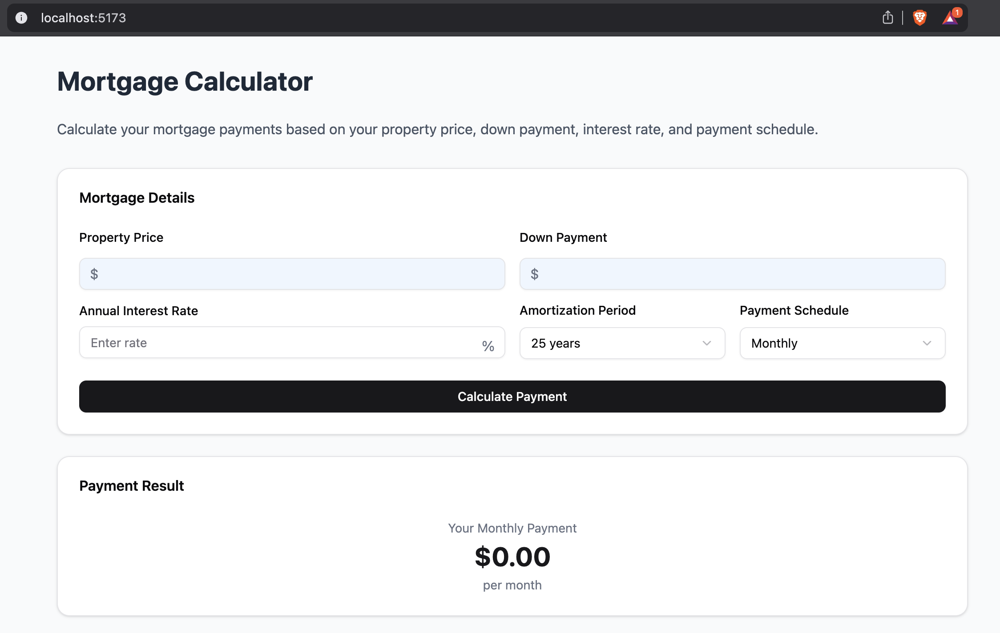
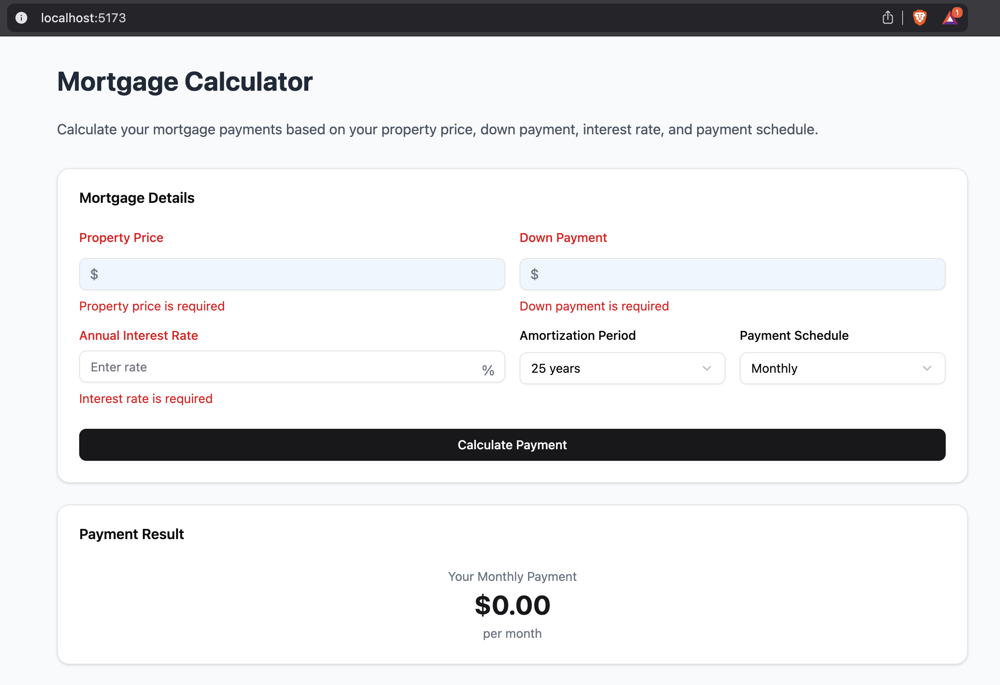
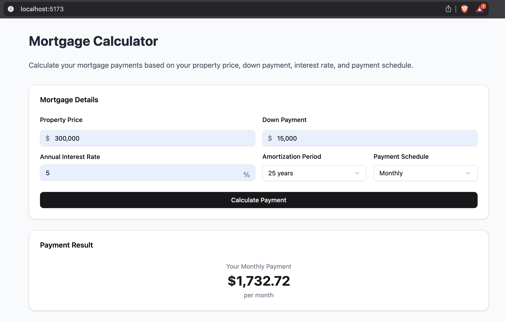
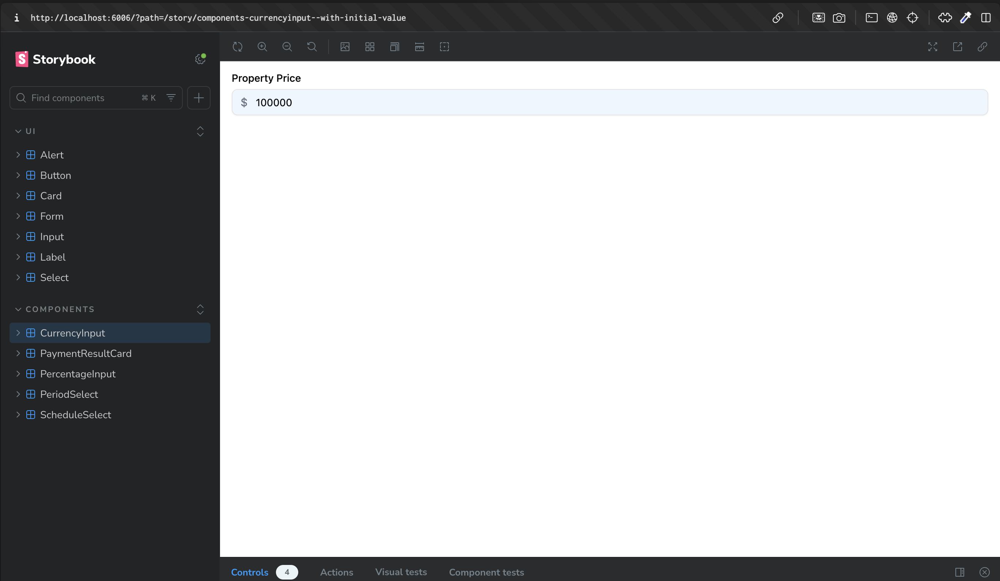
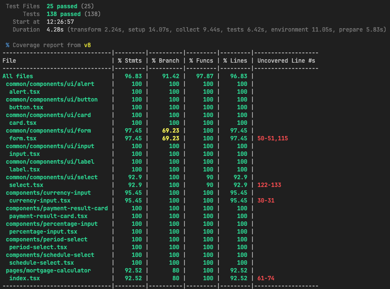
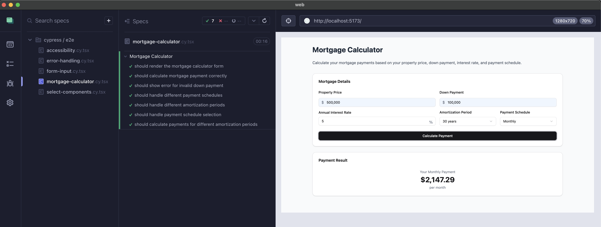
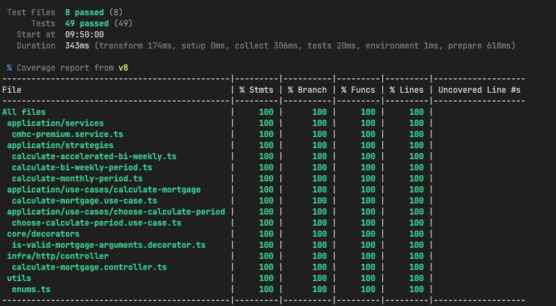

## 🚀 Mortgage Calculator App

This project was build using React (Vite), TailwindCSS, ShadcnUI, Node.js, Express, Cypress and Vitest

Below I explained a little of patterns:

### Frontend

Composition Pattern

Used destructuring of components into smaller parts in order to ensure their flexibility and scalability

### Backend

Clean Architecture (with Dependency Injection)

Clean architecture was used to develop a scalable API, its responsibilities defined and abstraction dependency

Strategy

The Strategy pattern is used in the backend to calculate mortgage payments based on the chosen schedule type (monthly, biweekly, or accelerated biweekly).

## 🔥 Prerequisites

Before you begin, ensure you have the following installed on your machine:

- Node.js (>= 22.x)
- npm (>= 11.x)

## 💾 Installation (Frontend)

1. Clone the repository:

```sh
# Clone this repository
$ git clone https://github.com/wallacefreitas/mortgage-calculator.git

# Access web project folder
cd mortgage-calculator/web
```

2. Adjust .env file:

```sh
# Rename .env.sample to .env
$ mv .env.sample .env

# Adjust the content of variable with your address + port
VITE_API_URL=http://localhost:3001/api/v1
```

3. Install the dependencies:

```sh
npm install
```

4. Running the Application

```sh
npm run dev
```

5. Running tests

```sh
npm run test:unit           // For unit tests
npm run test:unit:coverage  // For unit tests (coverage)
npm run cypress:web         // For e2e tests
```

## 💾 Installation (Backend)

1. Clone the repository:

```sh
# Clone this repository
$ git clone https://github.com/wallacefreitas/mortgage-calculator.git

# Access web project folder
cd mortgage-calculator/server
```

2. Install the dependencies:

```sh
npm install
```

3. Running the Application

```sh
npm run dev
```

4. Running tests

```sh
npm run test:unit           // For unit tests
npm run test:unit:coverage  // For unit tests (coverage)
npm run cypress:web         // For e2e tests
```

## 📂 Project Structure

```sh
mortgage-calculator/
├─── web/
├───── src/
│       ├── common/
│       │   ├── components/
│       │   └── utils/
│       ├── components/
│       ├── context/
│       ├── hooks/
│       ├── shared/
│       │   ├── utils/
│       ├── App.tsx
│       ├── global.css
│       ├── index.css
│       └── main.tsx
├───── index.html
├───── package.json
├───── tsconfig.json
│───── vite.config.ts
│─── server/
├───── src/
│       ├── application/
│       ├── core/
│       ├── infra/
│       ├── utils/
│       ├── index.ts
│       └── routes.ts
```

## ⚙️ Services

| Description (App) | Host                  | Port |
| :---------------- | :-------------------- | :--: |
| application       | http://localhost:5173 | 5173 |
| server            | http://localhost:3001 | 3001 |
| storybook         | http://localhost:6006 | 6006 |

## 📷 Screenshots

### Application

Frontend (Initial Screen):



Frontend (With validations):



Frontend (Calculated):



### Storybook

Frontend Storybook:



### Tests

Frontend (Unit Tests - Coverage)


Frontend Cypress (E2E Tests):


Backend (Unit Tests - Coverage)


## 🔮 Future Implementations

✓ Improve coverage of tests (unit and e2e) <br>
✓ Implement integrated tests (backend) <br>

## 📝 License

This project is under license MIT.

Made with ♥️ by Wallace de Freitas 👋🏻
